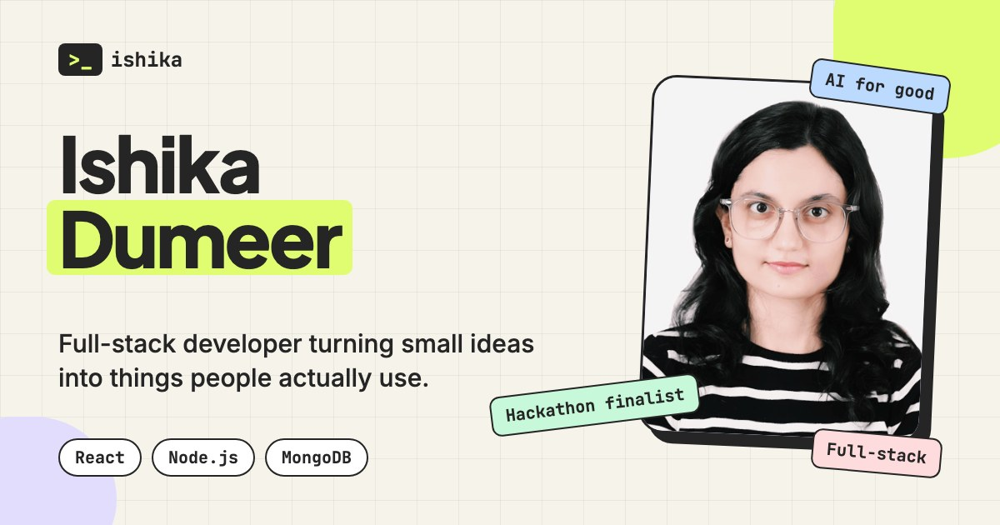

<div align="center">

# Ishika Dumeer: Portfolio

**Where ideas meet execution.**

A creative, animated developer portfolio built with React, Vite and Framer Motion.

[**Live site →**](https://ishika-dumeer.vercel.app/) · [LinkedIn](https://www.linkedin.com/in/ishika-dumeer/) · [GitHub](https://github.com/Ishika1106)



</div>

---

## About

This is the React rebuild of my portfolio, originally designed in Framer. I recreated the look and feel in code, then reworked the projects section and added more motion, so it feels playful but still technical.

## Highlights

- **Stacked project showcase.** Each project is a full-width card that pins and layers over the previous one as you scroll, with a 3D-tilt browser frame, shine on hover and floating tech chips.
- **Terminal hero.** A typing terminal, animated headline reveal and floating shapes.
- **Playful details.** Custom trailing cursor, scrolling tech-stack marquee, sticker-style tags, scroll progress bar and a "copy email" button with a toast.
- **Fully responsive.** A mobile drawer menu, stacked layouts on small screens, and touch-friendly behaviour (no hover tilt on touch devices).
- **Respects reduced motion.** Animations are switched off for visitors who prefer less motion.
- **Share-ready.** Open Graph and Twitter tags with a custom 1200×630 preview image, plus a favicon.

## Projects featured

| Project | What it is | Links |
| --- | --- | --- |
| **Awaaj** | Anonymous domestic-abuse reporting. Reports are hidden inside ordinary images using LSB steganography, with AI-assisted narratives and a nearby NGO/police/shelter finder. | [Code](https://github.com/Ishika1106/Awaaj) |
| **Blessings Clinic** | Website for a pediatric clinic in Janakpuri, Delhi, with online booking. | [Live](https://blessings-clinic.web.app/) |
| **Krishva** | Crop disease detection from a leaf photo, with remedies and voice output in English and Hindi. | [Code](https://github.com/Ishika1106/Krishva) |
| **Cedar & Sage** | Responsive 7-page restaurant site built with React and Vite. | [Live](https://cedar-sage.vercel.app) · [Code](https://github.com/Ishika1106/Cedar-Sage) |

## Tech stack

- **React 18** with function components and hooks
- **Vite 5** for dev server and build
- **Framer Motion** for scroll, tilt and entrance animations
- **Plain CSS** (custom properties, grid, `color-mix`, `clip` overflow), with no UI framework
- Fonts: Plus Jakarta Sans, Inter and JetBrains Mono (Google Fonts)

## Getting started

```bash
# 1. Install dependencies
npm install

# 2. Start the dev server (http://localhost:5173)
npm run dev

# 3. Build for production (outputs to dist/)
npm run build

# 4. Preview the production build locally
npm run preview
```

Requires Node.js 18 or newer.

## Project structure

```
.
├── index.html              # Entry HTML, SEO and social meta tags
├── vite.config.js          # React plugin and site-URL injection for meta tags
├── public/
│   ├── assets/             # Project screenshots and profile photo
│   ├── og-image.jpg        # Social preview image (1200×630)
│   └── favicon.svg
└── src/
    ├── main.jsx
    ├── App.jsx             # Page composition
    ├── data.js             # ALL site content: edit text, projects and links here
    ├── styles.css          # Global styles and responsive rules
    └── components/
        ├── Nav.jsx         # Header and mobile drawer
        ├── Hero.jsx        # Headline and typing terminal
        ├── Marquee.jsx     # Scrolling tech stack
        ├── About.jsx
        ├── Projects.jsx    # Stacked showcase cards
        ├── Services.jsx
        ├── Experience.jsx  # Achievements
        ├── Faqs.jsx
        ├── Footer.jsx      # Contact actions
        ├── Cursor.jsx
        ├── Progress.jsx    # Scroll progress bar
        └── Reveal.jsx      # Scroll-in animation wrapper
```

## Customising

Almost everything lives in [`src/data.js`](src/data.js):

- **Profile and copy:** name, intro, about text, email and social links.
- **Projects:** add or edit an entry in `projects`. Each one takes a title, blurb, tech stack, screenshot (`public/assets/`), accent colour, and optional `live` and `code` links. A button only shows if its link is set.
- **Services, achievements and FAQs:** edit the `services`, `experience` and `faqs` arrays.

To change the colours, edit the CSS variables at the top of [`src/styles.css`](src/styles.css).

## Deployment

The site is deployed on **Vercel**, which auto-detects Vite (build command `npm run build`, output directory `dist`). Pushing to the connected branch triggers a new deployment.

**Social preview URL.** Open Graph images need absolute URLs, so `vite.config.js` injects the site address into `index.html` at build time. It defaults to `https://ishika-dumeer.vercel.app`. If you move to a custom domain, set the `SITE_URL` environment variable in your Vercel project settings (for example `https://yourname.dev`) and redeploy.

After changing the preview image, refresh the cached copy with [LinkedIn Post Inspector](https://www.linkedin.com/post-inspector/).

## Contact

Have a project in mind? Use the **Start a project** button on the site, or find me on [LinkedIn](https://www.linkedin.com/in/ishika-dumeer/).

---

<div align="center">

Designed in Framer, rebuilt in React, with a lot of ☕.

</div>
